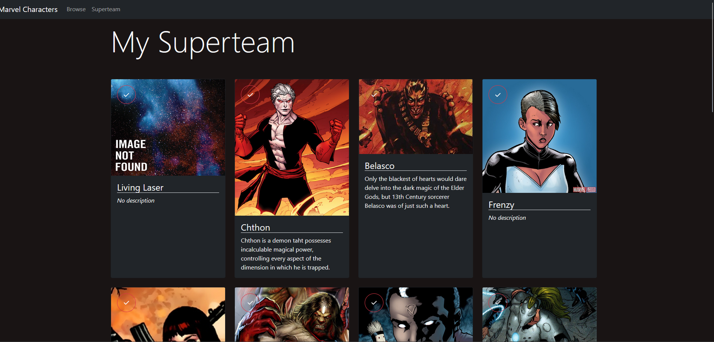

# marvel_api


*Data provided by Marvel. © 2014 Marvel*

This application allows you to browse through characters from the Marvel universe, and choose them on for your Superteam.
I made this application to train myself on Node.js and React, using the Marvel API. More infos about it [here](https://developer.marvel.com/documentation/getting_started/)

## How to setup

First, you need to have a Marvel account. Then you need to go to [your account](https://developer.marvel.com/account), and get your public and private keys.

## Running the server

With your favorite command prompt, go to the server folder, and run
```
npm install
```

In the data folder, create a new file name "credentials.json", and put this inside:
```
{
    "publicKey": "yourPublicKey",
    "privateKey": "yourPrivateKey"
}
```

Replace the keys with the ones you got from the Marvel website.

Then, run:
```
npm start
```

## Running the client

In an other command prompt, go to the client folder, and run
```
npm install
```
Then, run:
```
npm start
```
